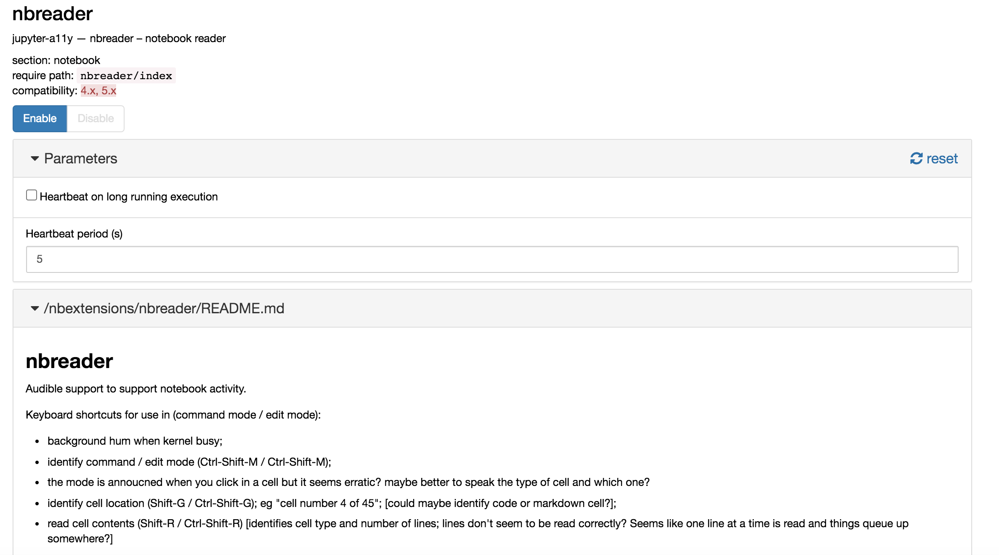

# `Jupyter-a11y` Project `nbreader`

An accessibility extension for Jupyter notebooks: add audible cues and feedback to support notebook activity.

[](https://mybinder.org/v2/gh/ouseful-backup/jupyter-a11y/packaged)


Originally developed here: http://jameslmartin.github.io/jupyter-a11y/ https://github.com/jameslmartin/jupyter-a11y/

Installed as extension: `nbreader`



Keyboard shortcuts for use in (command mode / edit mode):

- background hum when kernel busy;
- identify command / edit mode (Ctrl-Shift-M / Ctrl-Shift-M);
- the mode is annoucned when you click in a cell but it seems erratic? maybe better to speak the type of cell and which one?
- identify cell location (Shift-G / Ctrl-Shift-G); eg "cell number 4 of 45"; [could maybe identify code or markdown cell?];
- read cell contents (Shift-R / Ctrl-Shift-R) [identifies cell type and number of lines; lines don't seem to be read correctly? Seems like one line at a time is read and things queue up somewhere?]


### Installation

Install via:

`pip install --upgrade git+https://github.com/ouseful-backup/jupyter-a11y.git@packaged`

The extension should be automatically installed and enabled.

If you need to do things manually:

```
jupyter nbextension uninstall nbreader
jupyter nbextension install nbreader --user
jupyter nbextension enable nbreader/index
```

To disable the extension:

```
jupyter nbextension disable nbreader/index

```
